# Marketplace Web App

A simple marketplace application where users can list items, communicate with each other, and manage buying and selling inside the platform. Built using Laravel and Bootstrap.

---

## Screenshots

### Home Page
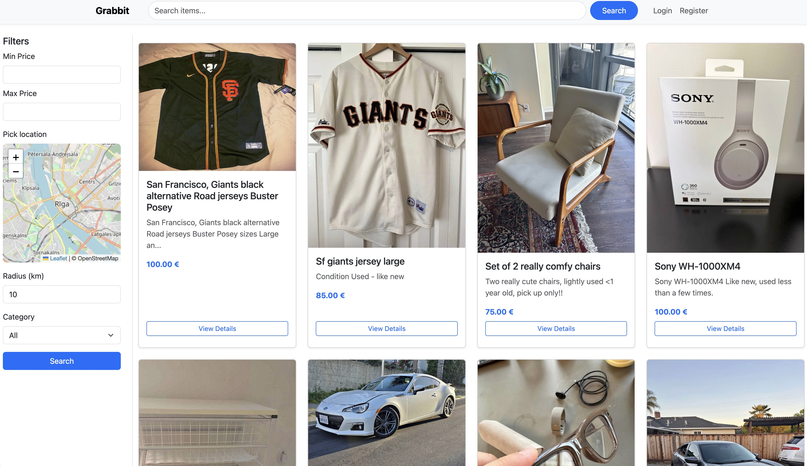

The main page where all listings are displayed. Users can browse items and use filters to narrow down results.

---

### Login
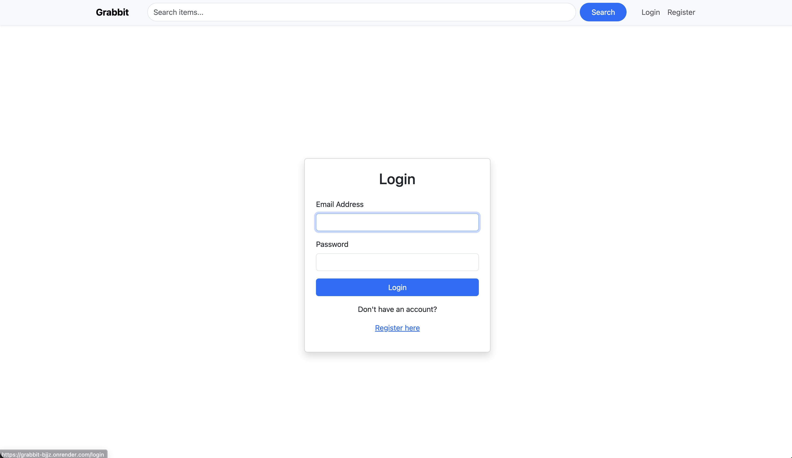

Login page for existing users to access their accounts.

---

### Register
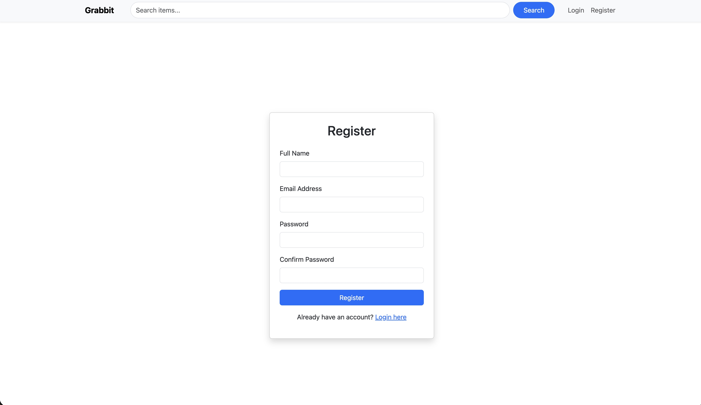

Registration page for new users to create an account.

---

### User Profile
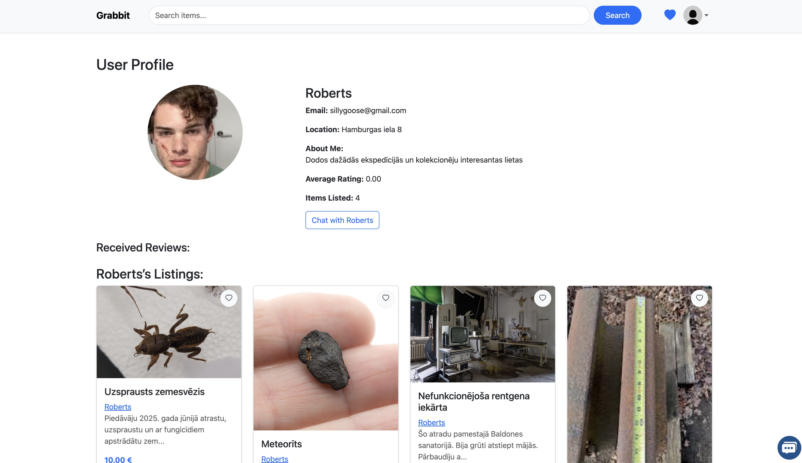

Public user profile showing user information, their listings, and the option to start a chat.

---

### Create Item
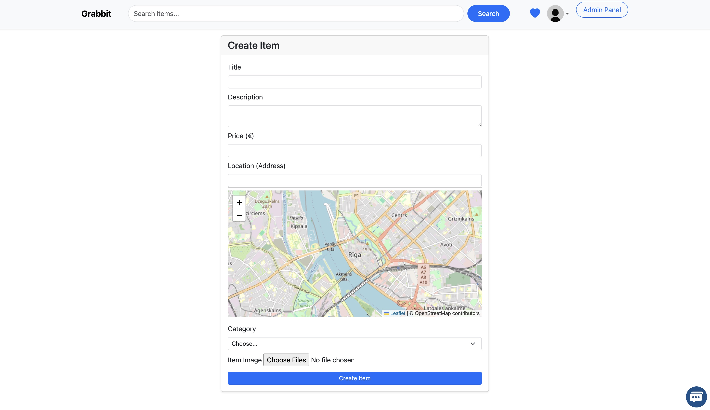

Form used to create new listings with title, description, price, images, and location.

---

### Item Details
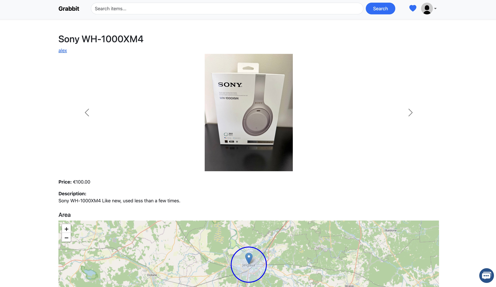
(screenshots/show1.jpg)

Detailed view of a listing including images, description, map location, comments, and report option.

---

### Wishlist
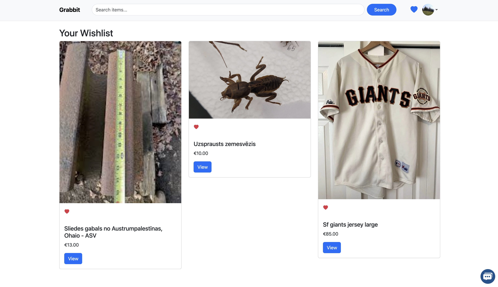

Page showing items saved by the user for later viewing.

---

### Chat System
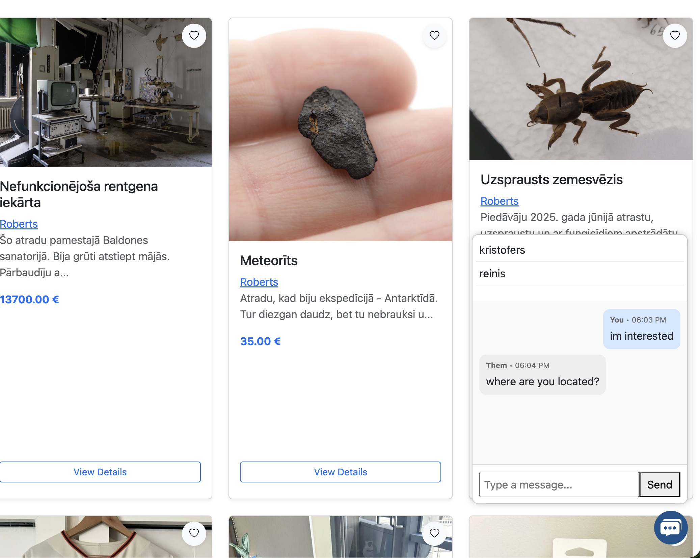

Messaging system that allows users to communicate directly with each other.

---

### Select Buyer / Mark as Sold
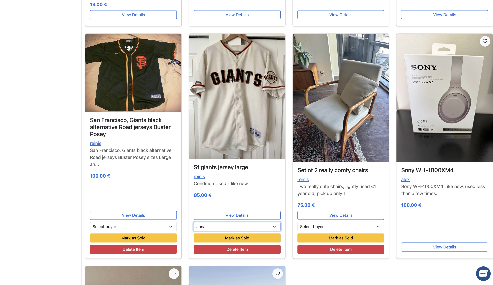

Interface for sellers to choose a buyer and mark an item as sold.

---

### Admin Panel - User Promotion
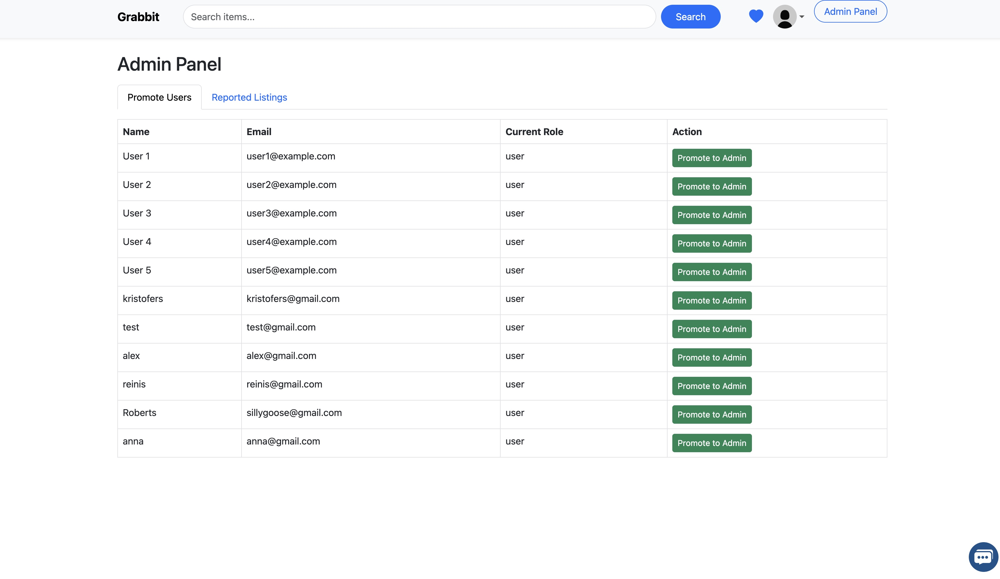

Admin feature for promoting users to administrator role.

---

### Admin Panel - Reported Listings
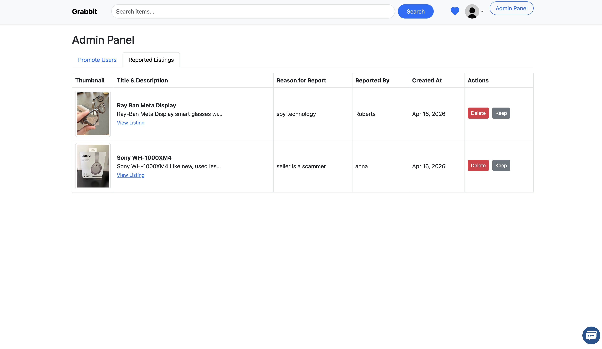

Admin view showing reported listings that require moderation.

---

## Features

- User authentication system
- Item listing creation and management
- Image uploads for listings
- Wishlist functionality
- Direct messaging between users
- Reporting system for listings
- Admin moderation tools
- Mark items as sold with buyer selection

---

## Tech Stack

- Laravel 12
- Blade templates
- Bootstrap 5
- MySQL / PostgreSQL
- Leaflet for maps